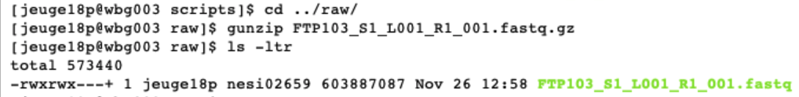
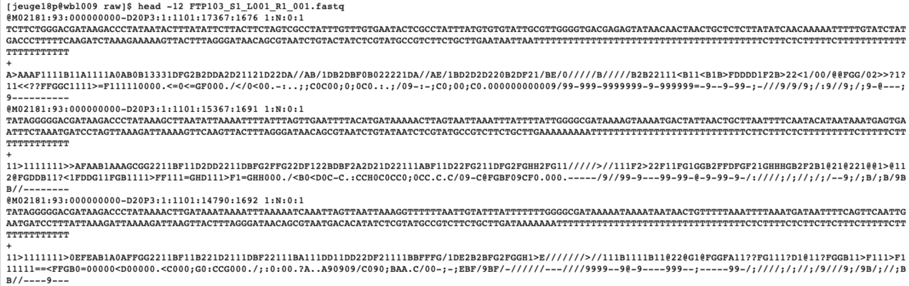
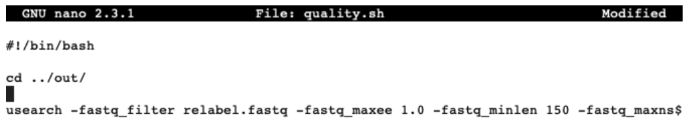
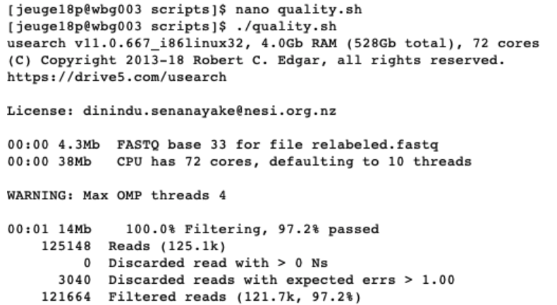
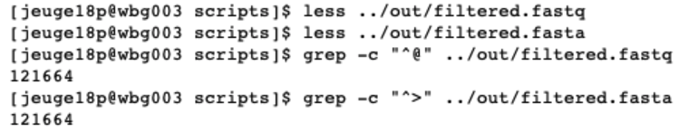

# Bioinformatics for eDNA metabarcoding

_Dr. Hugh Cross  
Dr. Lara Urban  
Dr. Gert-Jan Jeunen_

## _Chapter 1: Quality control_

#### Introduction

As a start, let's navigate to our user `folder`. Next, we will copy the data over from the `resources folder` to our own `user folder`. 

```
cd obsss_2020/users/<username>/

cp -r /nesi/project/nesi02659/obss_2020/resources/day5/eDNA /nesi/project/nesi02659/obss_2020/users/<username>

cd eDNA/

ls -ltr
```
  
Before we get started with the bioinformatics, we will familiarize ourselves with the folder setup. within the eDNA folder, we have seven subfolders:  
  
1. notebooks: contain the supplementary information for this workshop
2. meta: contains the metadata used during the workshop
3. out: will contain any output fiels we generate during the workshop
4. raw: contains the raw sequencing file provided by the sequencing service
5. scripts: the folder we will use to create and run our bioinformatic scripts
6. stats: will be used for the statistical part of this workshop
7. taxonomy: will be used for the taxonomic assignment part of this workshop  

#### Checking raw sequencing data files with text editors and FastQC

The first thing we need to do is check if the sequence file provided to us is in the correct format (software: text editor in terminal) and determine if there were no issues with our library during sequencing (software: FastQC). The sequencing service has provided us with an output file from the Illumina MiSeq sequencer. This file is in a `.fastq` format and zipped in our case to reduce the file size `.fastq.gz`. As a first step, we will unzip the file, as it might interfere with some of the downstream analysis we plan to do:

```
cd ../raw/

gunzip FTP103_S1_L001_R1_001.fastq.gz
```

As you learned during Day 1 of the workshop, the `.fastq` format is a text-based format for storing both a biological sequence and the corresponding quality scores. The layout is predetermined, with four lines per sequence:
  
1. line 1: begins with a `@` character and is followed by a sequence identifier
2. line 2: is the raw sequence letters
3. line 3: is the line separating the sequence and quality scores with a `+`
4. line 4: encodes the quality values for the sequence in line 2
  
Now that we have unzipped our sequencing file, we can see that we have the normal `.fastq` in our raw folder. 

```
ls -ltr
```



Due to the size of the file, opening them in text editors can be problematic. Luckily, we can check the layout of the file using the text editor in the terminal. So, let's look at the first 12 lines of the raw sequencing file.

```
head -12 FTP103_S1_L001_R1_001.fastq
```



From the output, we can see the first twelve lines of our raw sequencing file (the lines containing the actual sequence and quality scores are wrapped over multiple lines) following the structure we described above.  
  
Next, we will look at the quality of the raw sequencing file to make sure no issues arose during sequencing. The program we will be using is FastQC (website: https://www.bioinformatics.babraham.ac.uk/projects/fastqc/). This software has a graphical user interface (GUI). However, today we will be using the command line option. This program will report on basic statistics, quality of the data, sequencing length, etc. Before we can run the software, we need to load in the module to make it accessible to us.

```
module load FastQC/0.11.9

fastqc FTP103_S1_L001_R1_001.fastq
```


When running this command, an `.html` file will be created in our raw folder. When opening this (double clicking), it will direct us to an interactive document. For eDNA data, we want to check in this report that:
  
1. The _per base sequence quality_ stays within the green area.
2. The _number of sequences_ you received.
3. The data does not contain _N_ bases.
4. All sequences have _the same length_, equal to the cycle number of the sequencing kit.


## _Chapter 2: Demultiplexing sequencing data_

#### Introduction

Now that we have checked the raw sequencing file and made sure everything is ready to process our data, we will assign each sequence to the corresponding sample, a process referred to as demultiplexing.  
  
As mentioned during the introduction presentation, each sample was assigned a specific barcode combination, with at least three base pair differences between each barcode used in the library. By searching for these specific sequences, which are situated at the very beginning and very end of each sequence, we can assign each sequence to its sample. We will be using OBITools (website: https://pythonhosted.org/OBITools/welcome.html) for demultiplexing our dataset today, as it is one of the few software programs that can simultaneously detect dual barcodes. OBITools requires an additional text file with information about the barcode sequences assigned to each sample and primer sequences used to amplify the DNA. The text file is formatted in a way, so that you have a single line per sample with information separated by tabs. The forward and reverse barcode (indicated in the text file by ‘tags’) are separated by ‘:’. This file has been provided to you in the folder ‘meta’. Let's open this file to see how it is structured.

```
cd ../meta/

nano Aramoana_prelim_barcode_info.txt
```


While assigning each sequence to a sample, OBITools will remove the barcode and primer sequences of each sequence. Therefore, no additional step is needed when using this software. This, however, is not always the case when using different software programs.

#### Assigning sequences to corresponding samples

__(! This step will be omitted for the workshop due to time constraints !)__

Sample code will be given below if you would like to try and run this part of the bioinformatic pipeline on your personal computer. The `ngsfilter` command will take ~20 minutes to complete. The subsequent commands are needed to prepare the file for Chapter 5: Quality filtering, where we will resume this workshop.

```
ngsfilter -t ../meta/Aramoana_prelim_barcode_info.txt -u ../out/unidentified.fasta -e 1 FTP103_S1_L001_R1_001.fastq > ../out/assigned.fastq

obistat -c sample ../out/assigned.fastq

obiannotate -k sample ../out/assigned.fastq ../out/annotated.fastq

obisplit -t sample ../out/annotated.fastq

cd ../scripts/

nano relabel
#!/bin/bash

cd ../out/

for fq in FTP103_A*; do usearch -fastx_relabel $fq -prefix $fq. -fastqout relabeled_$fq; done

cat relabeled_* > relabeled.fastq
```

We can check this 

## _Chapter 5: Quality filtering_

#### Introduction

During the quality filtering step, we will discard all sequences that do not adhere to a specific set of rules. We will be using the program USEARCH for this step (website: https://www.drive5.com/usearch/). During the quality filtering, we will discard all sequences that have one or multiple unassigned bases, denoted as ‘N’ in the sequence. Sequences shorter than our amplicon length will be discarded as well. Lastly, we will filter out sequences that have an expected error higher than 1.0. This expected error is representative of a miscalled base in our sequence by the Illumina MiSeq sequencing machine. 

#### Filtering data based on quality and length

Now that we'll be using a different software program, we'll need to load the module of USEARCH

```
module load USEARCH/11.0.667-i86linux32
```  
  
The file we will be working on is `relabeled.fastq` and is placed in the `out` folder. We will now be making our first bioinformatcs script in the `scripts` folder and execute the command from there.

```
cd ../scripts/

nano quality.sh

#!/bin/bash

cd ../out/

usearch -fastq_filter relabeled.fastq -fastq_maxee 1.0 -fastq_minlen 150 -fastq_maxns 0 -fastqout filtered.fastq -fastaout filtered.fasta
```



Once the script is written we will exit and save by pressing `ctr + X`. Next, we need to make the file executable and run the script by:

```
chmod +x quality.sh

./quality.sh
```

The command `nano quality.sh` will generate a new file with the name `quality.sh` and open it for us in the command line text editor. The first line of the script will start with ‘#!/bin/bash’, telling the computer what kind of code is written inside the script and how it needs to be interpreted. In the next line, we will specify the directory where our file is located. `usearch` is the software we will use to filter our data based on quality and what follows are different parameters to filter our data and produce output files.  
  
When executing this script, USEARCH will provide us with information about how many sequences or ‘reads’ were found in the ‘relabeled.fastq’ file and how many sequences passed our filtering parameters. These sequences are written to two files, one `.fastq` file and one `.fasta` file. The only difference between the two files is that the `.fastq` file will contain information on the quality of the sequences.




To check if these files have been generated, we can list all the files in the `out` directory and read the files to determine their structure. It is always a good strategy to check intermediate steps to make sure the code is doing what it is supposed to do. Besides just checking if the files are there, we can even count the number of sequences in each file to see if it matches what USEARCH reported on.

```
ls -ltr ../out/

less ../out/filtered.fastq

q

less ../out/filtered.fasta

q

grep -c "^@" ../out/filtered.fastq

grep -c "^>" ../out/filtered.fasta
```

The command `less` will open a text editor to view the `filtered.fastq` and `filtered.fasta` files. Pressing enter will move us down line by line and exiting the text editor can be done by pressing `q`. When looking at the structure of both files, we can see that each sequence in the fastq file starts with `@` and in the fasta file with `>`. Knowing this, we can use the `grep` command to count the number of instances these two characters occur at the beginning of the line in our files, thereby counting the number of sequences in our files. The output shows us the identical number of sequences as reported by USEARCH.



The `filtered.fastq` file has been generated for the sole purpose to determine if the quality filtering was successful. We, therefore, will run the `fastqc` command on the `filtered.fastq` file and compare the two `fastqc` reports. An example figure of the report can be found below. Do you see the differences compared with the raw data file?  
  
```
fastqc ../out/filtered.fastq
```


From this report, we can see that:
1.	The number of sequences has reduced, due to discarding poor quality sequences.
2.	The per base quality has improved.
3.	The length of the sequences has changed and is now reflecting the amplicon size.
