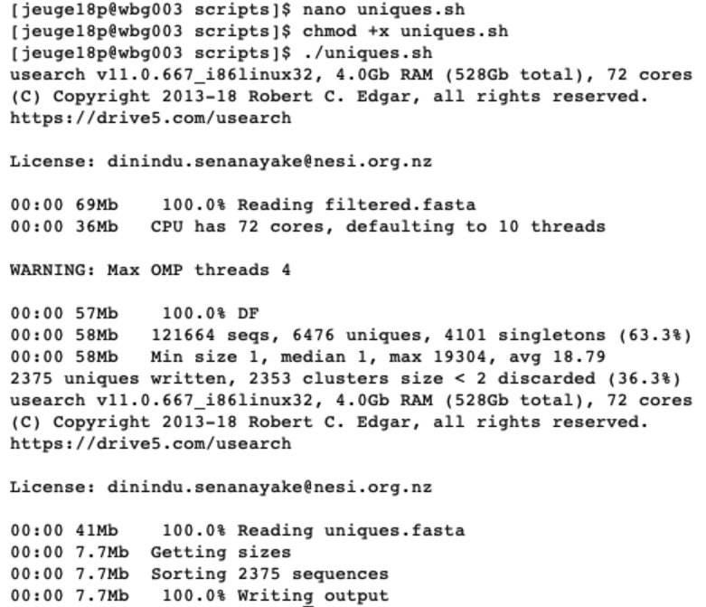
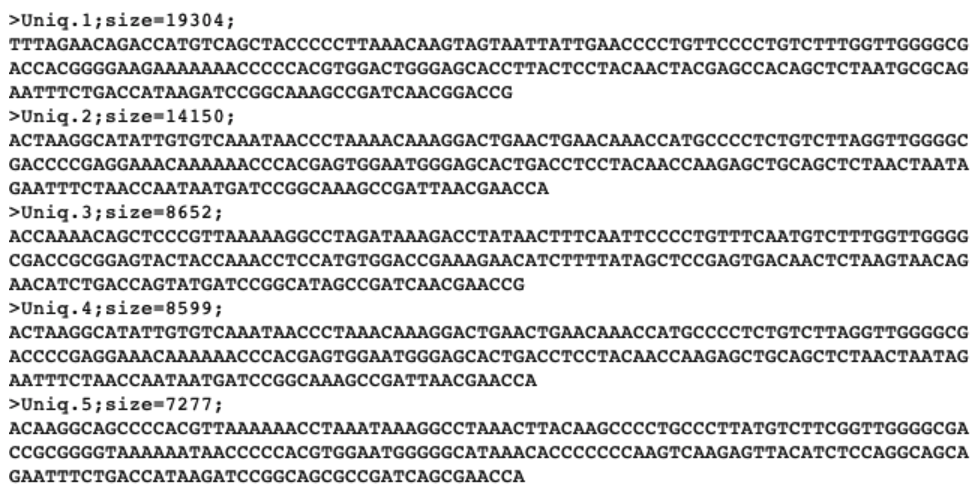
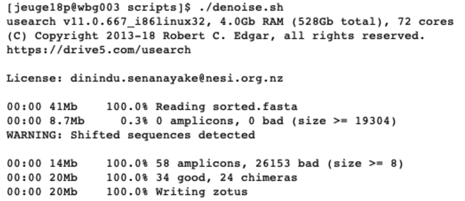
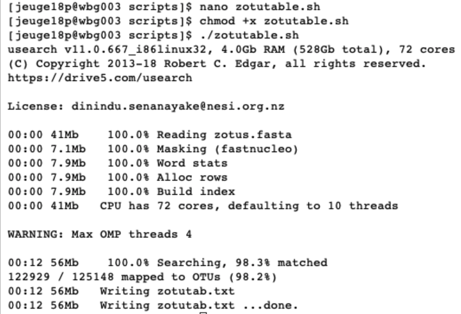

## _Chapter 6: Denoising or clustering_

#### Introduction

Now that we have a high quality data file `filtered.fasta` that contains information about which sequence belongs to what sample, we are ready for the next step in our bioinformatics’ pipeline, i.e., looking for biologically meaningful OR biologically correct sequences. This is done through denoising or clustering the dataset, while at the same time removing any chimeras and left-over PCR and/or sequencing errors.  
  
Scientists are currently debating on what the best approach is to obtain `biologically meaningful` or `biologically correct` sequences. There are numerous papers published on this topic. Unfortunately, this is something that is outside the scope of this workshop to go into at depth. But here is the basic information…  
  
There are basically two trains of thought, clustering the dataset or denoising the dataset. With clustering the dataset, an OTU sequence should be at least a given percentage different from all other OTUs and should be the most abundant sequence compared to similar sequences. People traditionally chose to cluster at 97%, which means that the variation between sequences should be at least 3%. The concept of OTU clustering was introduced in the 1960s and has been debated ever since. With denoising the dataset, on the other hand, the algorithm attempts to identify all correct biological sequences in the dataset, which is visualized in the figure below. This schematic shows a clustering threshold at 100% and trying to identify errors based on abundance differences. The retained sequences are called ZOTU or Zero-radius Operational Taxonomic Unit. In other software programs they might also be called ASVs.


This difference in approach may seem small but has a very big impact on your final dataset!  
  
When you denoise the dataset, it is expected that one species may have more than one ZOTU, while if you cluster the dataset, it is expected that an OTU may have more than one species assigned to it. This means that you may lose some correct biological sequences that are present in your data when you cluster the dataset, because they will be clustered together. In other words, you will miss out on differentiating closely related species and intraspecific variation. For denoising, on the other hand, it means that when the reference database is incomplete, or you plan to work with ZOTUs instead of taxonomic assignments, your diversity estimates will be highly inflated.  
  
For this workshop, we will follow the denoising pathway, since most people are working on vertebrate datasets with good reference databases and are interested in taxonomic assignments.


#### Finding unique sequences and sorting by abundance

Prior to clustering or denoising, we need to dereplicate our data into unique sequences. Since metabarcoding data is based on an amplification method, the same starting DNA molecule can be sequenced multiple times. In order to reduce file size and computational time, it is convenient to combine these duplicated sequences as one and retain information on how many were combined. Additionally, we will remove sequences that only occur once in our data and attribute them to sequence and PCR error. Lastly, we will sort the sequences based on abundance.

```
nano uniques.sh

#!/bin/bash

cd ../out/

usearch -fastx_uniques filtered.fasta -fastaout uniques.fasta -relabel Uniq. -sizeout -minuniquesize 2

usearch -sortbysize uniques.fasta -fastaout sorted.fasta
```

Once the script is written we will exit and save by pressing ‘ctr + X’. Next, we need to make the file executable and run the script by:

```
chmod +x uniques.sh

./uniques.sh
```

When executing this script, USEARCH will let us know how many unique sequences were found and how many of those only occurred once. In the next part, USEARCH also let us know how many unique sequences were sorted based on abundance.



If the script successfully executed, we will now have generated two new files `uniques.fasta` (containing information on the number of unique sequences and their abundance from the filtered `filtered.fasta` file) and `sorted.fasta` (identical to `uniques.fasta`, but sorted by abundance). Let’s open them and see what is inside.

```
ls -ltr ../out/

less ../out/sorted.fasta

q

grep -c "^>" ../out/sorted.fasta
```

We now see that the names of our sequences have changed, due to the ‘-relabel’ parameter. We also have some additional information following the name, where size is indicating the number of times this unique sequence was found across the full dataset.  
  


#### Denoising the dataset

Now we can use the `sorted.fasta` file to obtain `biologically meaningful` sequences by denoising the data with the following script.

```
nano denoise.sh

#!/bin/bash

cd ../out/

usearch -unoise3 sorted.fasta -zotus zotus.fasta -tabbedout unoise3.txt
```

Once the script is written we will exit and save by pressing `ctr + X`. Next, we need to make the file executable and run the script by:

```
chmod +x denoise.sh

./denoise.sh
```



After denoising, we are left with 58 amplicon sequences, of which 34 are considered as good and 24 as chimeras. This script will have generated the `zotus.fasta` file, which we will use in the next chapter for taxonomic assignment.

#### Generating a ZOTU table

All that is left to do is generating a ZOTU table. Such a table will have the same format as a count table from traditional survey techniques, where we have the species names as rows, sample locations as columns, and counts in each cell. For metabarcoding data, we will have ZOTU names as rows, sample locations as columns, and number of sequences in each cell. 

```
nano zotutable.sh

#!/bin/bash

cd ../out/

usearch -otutab relabeled.fastq -zotus zotus.fasta -otutabout zotutab.txt
```

Once the script is written we will exit and save by pressing `ctr + X`. Next, we need to make the file executable and run the script by:

```
chmod +x zotutable.sh

./zotutable.sh
```

To generate the ZOTU table, we used the prefiltered `relabeled.fastq` file. The reasoning behind this is that if the sequence matches the ZOTU generated on high quality data, we would like to include it, even though it has been assigned as a low-quality sequence.



The ZOTU table is a general text file and can be opened for easy viewing.  
  
Before we move to the next part of the workshop, taxonomic assignment, you might have wondered why we are making all these scripts? We could of course just enter the commands in the scripts in the command line and they would work just as well. The point of this is that there is a lot of trial and error happening when figuring out the correct parameters. You, therefore, would work on a small subset of data that would include a positive control from a mock community, your negative control and a couple of samples. We write these scripts to test the output on this small dataset. Once we get everything working, we can write one general script that invokes all the other ones and will run on the full dataset.  

Let's show this in an example:  
  
```
cd ../out/

shopt -s extglob

rm -- !(relabeled.fastq)

cd ../scripts/

nano run.sh

#!/bin/bash

./quality.sh
./uniques.sh
./denoise.sh
./zotutable.sh

chmod +x run.sh
./run.sh
```


We'll now move on to the next part of the workshop, taxonomic assignment.  
  
__Thank you very much for your attention!__


```python

```
